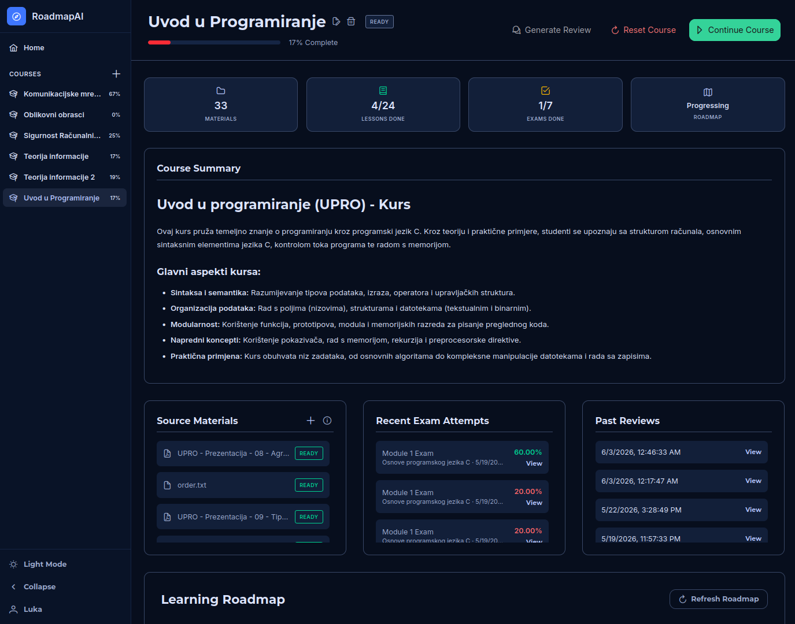

# RoadmapAI

Built as a Bachelor's thesis at the Faculty of Electrical Engineering and Computing (FER), University of Zagreb.

A personalized learning system for higher education that transforms uploaded course materials into structured, guided learning plans using large language models.

Upload your PDFs, PPTXs, DOCXs, and other materials — RoadmapAI extracts the text, generates a course roadmap with modules and lessons, and guides you through the content with interactive tasks, exams, and AI-powered feedback.



## Architecture

The project is split into three independent components:

- **`RoadmapAI.Client`** — Angular 21 frontend (Tailwind CSS 4, PrimeNG)
- **`RoadmapAI.Api`** — .NET 10 ASP.NET Core Web API with PostgreSQL
- **`Roadmap.AI`** — Python FastAPI microservice for AI/LLM integration

## Features

- **Course creation** with multi-format file upload (PDF, DOCX, PPTX, MD, TXT)
- **AI text ingestion** — extracts and normalizes material text on the fly
- **Roadmap generation** — produces a structured plan with modules, lessons, and a course summary
- **Lazy-loaded lessons** — content is generated on-demand when you click a lesson
- **Mini-tasks** — each lesson ends with a multiple-choice question and a hidden hint
- **Module & final exams** — auto-graded, unlock after completing prerequisite lessons
- **Personalized reviews** — AI analyzes your progress and exam results, then explains mistakes and suggests next steps
- **Progress tracking** — per-course completion percentages, cached for fast loading
- **JWT authentication** via HttpOnly cookies (ASP.NET Core Identity)
- **Light/dark mode**
- **Azure deployment** — two App Services, PostgreSQL, Blob Storage, GitHub Actions CI/CD

## Tech Stack

| Layer | Technology |
|---|---|
| Frontend | Angular 21, Tailwind CSS 4, PrimeNG |
| Backend | .NET 10, ASP.NET Core, Entity Framework Core |
| AI Service | Python 3.11+, FastAPI, Uvicorn |
| Database | PostgreSQL 18 |
| LLM | Google Gemini |
| Storage | Azure Blob Storage |
| CI/CD | GitHub Actions → Azure App Service |

## Project Structure

```
RoadmapAI/
├── RoadmapAI.Api/          # .NET Web API
│   ├── Controllers/
│   ├── Services/
│   ├── Data/
│   └── Models/
├── RoadmapAI.Client/       # Angular frontend
│   └── src/app/
│       ├── core/
│       ├── features/
│       ├── layout/
│       └── shared/
├── Roadmap.AI/             # Python AI microservice
│   ├── app/
│   ├── services/
│   └── prompts/            # LLM prompt templates (roadmap.txt, lesson.txt, exam.txt, review.txt)
├── Documentation/          # Thesis PDF, images, diagrams
└── Presentation/           # Defense presentation
```
